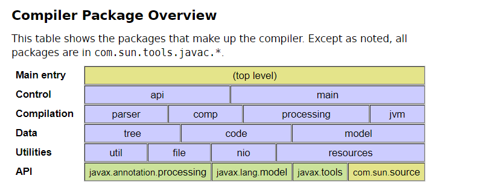

# Java  编译相关 API

Java 编译修改 api 说明：

- `javax.tools`：Java 编译器 API (JSR-199)。
- `javax.lang.model`：注解处理和编译器 Tree API 使用的语言模型 (JSR-296)。
  - `javax.lang.model.element`：语言元素。
  - `javax.lang.model.type`：类型。
  - `javax.lang.model.util`：语言模型工具。
- `javax.annotation.processing`：注解处理 (JSR-296)。
- `com.sun.source.*`： 编译器 Tree API，提供对 javac 工具使用的抽象语法树 AST 的只读访问。
- `com.sun.tools.javac.*（上图蓝色部分）`：编译器的内部实现类库，提供了编译过程中操作 AST 的功能。

包说明：

- javac：在没有引入 JSR-199 前，只能使用 javac 源码提供的内部 API sun.tools.jar.Main。
- jsr199：JSR-199（Java Compiler API） 引入了 Java 编译器 API，javax.tools.JavaCompiler 就是其中之一。
- jsr269：JSR-269（Pluggable Annotation Processing API）引入了注解处理器。
- sun：
    - com.sun.source.* 包下提供对 javac 工具使用的抽象语法树（AST） 的只读访问功能。
    - com.sun.tools.javac.*（上图蓝色部分） 是编译器的内部实现类库，提供了编译过程中操作 AST 的功能，可以在源码编译过程中修改源码实现。
- rewrite：第三方 AST 修改库。

具体参考：

- [Java 编程语言编译器组](https://openjdk.java.net/groups/compiler/)
- [Java编译过程：Compilation Overview](http://openjdk.java.net/groups/compiler/doc/compilation-overview/index.html)
- [Java 编译器 javac 笔记](http://nullwy.me/2017/04/javac-api/)
- 《The Hacker's Guide to Javac》

在 github 上也有相关开源库提供了修改 AST 的功能：

- [Rewrite](https://github.com/Netflix-Skunkworks/rewrite)
- [JavaParser](https://github.com/Javaparser/Javaparser)
